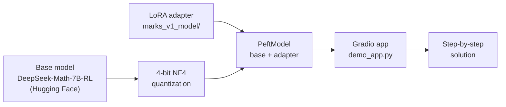
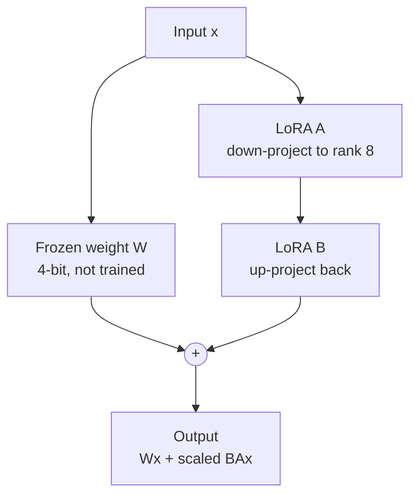
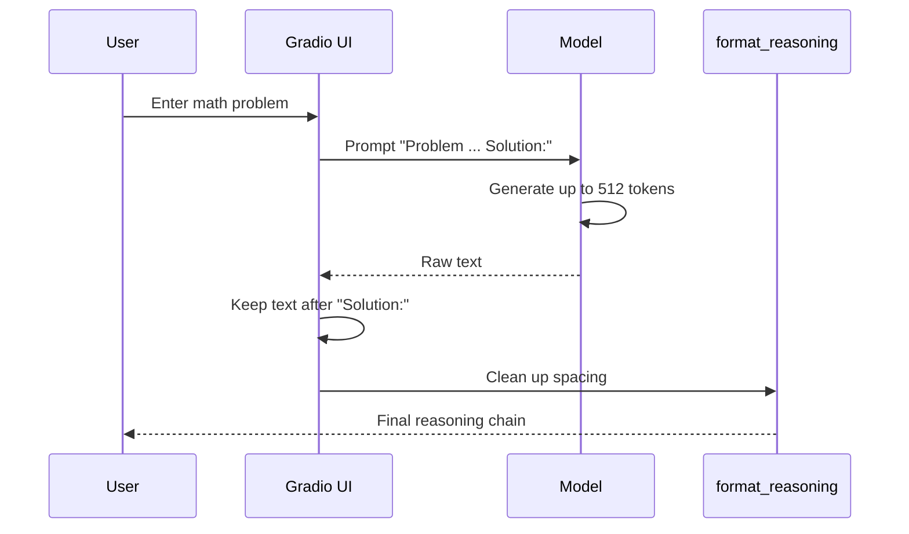
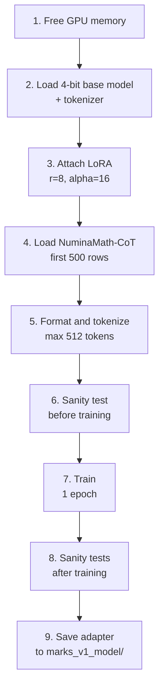
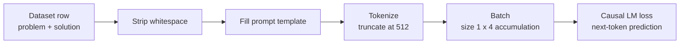
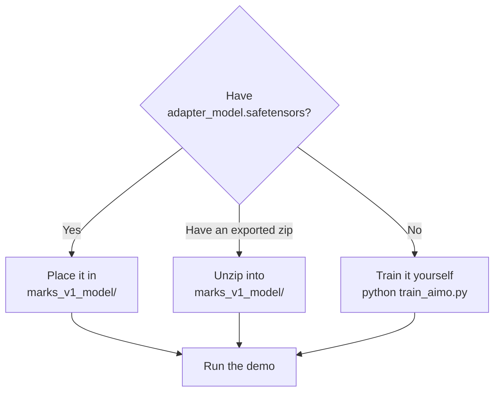
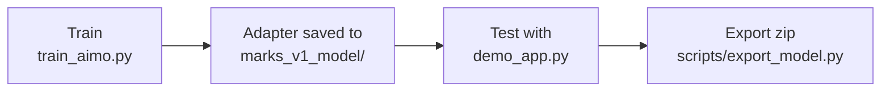
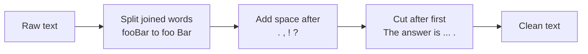
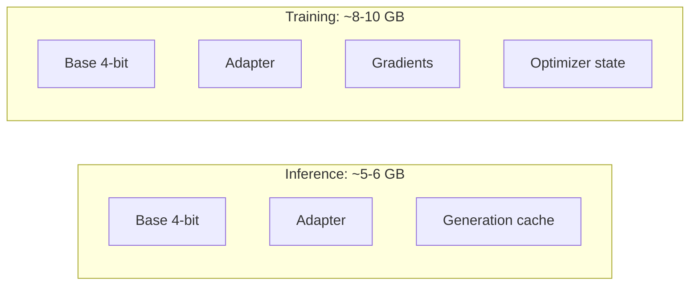
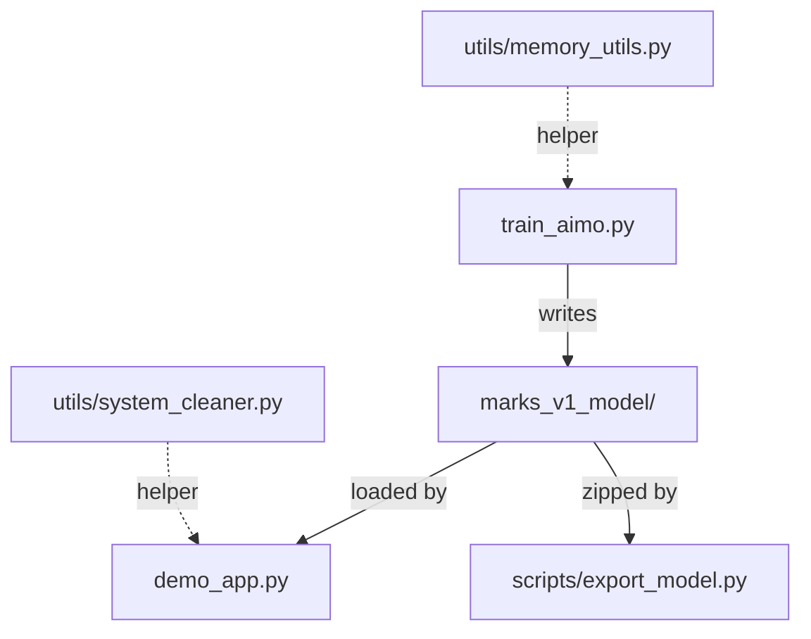

# AIMO-Marks-V1 | Mathematical Reasoning Engine

A LoRA fine-tune of **DeepSeek-Math-7B-RL** for step-by-step mathematical reasoning, quantized to 4-bit so it runs on consumer GPUs (about 6 GB VRAM for inference).


---

## Table of Contents

1. [Overview](#1-overview)
2. [How It Works](#2-how-it-works)
3. [Requirements](#3-requirements)
4. [Quick Start](#4-quick-start)
5. [Usage Examples](#5-usage-examples)
6. [Training From Scratch](#6-training-from-scratch)
7. [Configuration Reference](#7-configuration-reference)
8. [Memory Requirements](#8-memory-requirements)
9. [Project Structure](#9-project-structure)
10. [Troubleshooting](#10-troubleshooting)
11. [Known Limitations](#11-known-limitations)
12. [License and Acknowledgments](#12-license-and-acknowledgments)

---

## 1. Overview

AIMO-Marks-V1 adapts a math-specialized 7B language model to produce clear, worked solutions to algebra, arithmetic, and competition-style problems. Instead of retraining all 7 billion weights, it trains a tiny **LoRA adapter** (a few million parameters) on top of a frozen, 4-bit quantized base model.

**Key features**

| Feature | Detail |
|---|---|
| Step-by-step reasoning | Prompted and trained to show derivations, not just answers |
| 4-bit quantization | NF4 via bitsandbytes, fits in about 6 GB VRAM |
| LoRA fine-tuning | Rank 8 adapters on the attention `q_proj` and `v_proj` layers |
| Gradio web UI | One command to launch, with an optional public share link |
| Memory utilities | Helpers for clearing VRAM and stray processes (useful on Kaggle/Colab) |

---

## 2. How It Works

### 2.1 System at a glance

The base model is downloaded from Hugging Face and stays frozen. Only the small adapter in `marks_v1_model/` is specific to this project.



### 2.2 What LoRA changes inside the model

Each attention layer keeps its original weights **frozen**. LoRA adds a small trainable low-rank path next to `q_proj` and `v_proj`, and the two outputs are summed.



Scaling factor: `alpha / r = 16 / 8 = 2`.

### 2.3 Inference flow

What happens between typing a problem and reading the answer:



The prompt format matches training exactly:

```text
Problem: {problem}

Solution: 
```

### 2.4 Training pipeline

`train_aimo.py` runs all of these steps in order:



### 2.5 Training data flow

How one dataset row becomes a training example:



---

## 3. Requirements

- Python 3.8+
- NVIDIA GPU with CUDA (6 GB+ VRAM for inference, 8–10 GB for training)
- 8 GB+ system RAM
- Internet access on first run (downloads the base model and, for training, the dataset)

Dependencies (`requirements.txt`):

```text
torch>=2.0.0
transformers>=4.35.0
accelerate>=0.24.0
bitsandbytes>=0.41.0
peft>=0.6.0
gradio>=3.50.0
datasets>=2.14.0
psutil>=5.9.0
```

---

## 4. Quick Start

### 4.1 Install

```bash
git clone https://github.com/JoshuaOmosa/aimo-marks-v1.git
cd aimo-marks-v1

python -m venv venv
source venv/bin/activate        # Linux / macOS
# .\venv\Scripts\activate       # Windows

pip install -r requirements.txt
```

### 4.2 Get the adapter weights

The adapter weights file (`adapter_model.safetensors`) is **not stored in git** because `*.safetensors` is listed in `.gitignore`. Before running the demo, `marks_v1_model/` must contain:

```text
marks_v1_model/
├── adapter_config.json
├── adapter_model.safetensors     <-- you must supply this
├── tokenizer.json
└── tokenizer_config.json
```

Two ways to get it:



### 4.3 Run the demo

```bash
python demo_app.py
```

The first launch downloads the base model (several GB). When loading finishes, Gradio prints a local URL and, because the app uses `share=True`, a temporary public URL.

---

## 5. Usage Examples

> These are illustrative. Output is sampled (temperature 0.4), so exact wording will vary between runs.

**Bat and ball**

Input:

```text
A bat and a ball cost $1.10. The bat costs $1.00 more than the ball. How much does the ball cost?
```

Example output:

```text
Let x be the cost of the ball in dollars.
Then the cost of the bat is x + 1.00.
Total: x + (x + 1.00) = 1.10
2x + 1.00 = 1.10
2x = 0.10
x = 0.05

Therefore, the ball costs $0.05 (5 cents).
```

**Prime numbers**

Input:

```text
What is the sum of all prime numbers less than 20?
```

Example output:

```text
Prime numbers less than 20: 2, 3, 5, 7, 11, 13, 17, 19
Sum = 2 + 3 + 5 + 7 + 11 + 13 + 17 + 19 = 77
```

**Algebra (built-in demo example)**

```text
If x + y = 10 and x * y = 21, find x² + y².
```

Expected answer: `x² + y² = (x + y)² − 2xy = 100 − 42 = 58`.

### Using the model in your own code

```python
import torch
from transformers import AutoModelForCausalLM, AutoTokenizer, BitsAndBytesConfig
from peft import PeftModel

base_id = "deepseek-ai/deepseek-math-7b-rl"

tokenizer = AutoTokenizer.from_pretrained(base_id, trust_remote_code=True)
bnb = BitsAndBytesConfig(
    load_in_4bit=True,
    bnb_4bit_compute_dtype=torch.float16,
    bnb_4bit_quant_type="nf4",
)
base = AutoModelForCausalLM.from_pretrained(
    base_id, quantization_config=bnb, device_map="auto", trust_remote_code=True
)
model = PeftModel.from_pretrained(base, "./marks_v1_model")

prompt = "Problem: What is 15% of 240?\n\nSolution: "
inputs = tokenizer(prompt, return_tensors="pt").to("cuda")
out = model.generate(
    **inputs,
    max_new_tokens=256,
    do_sample=True,
    temperature=0.4,
    top_p=0.9,
    repetition_penalty=1.2,
    pad_token_id=tokenizer.eos_token_id,
)
print(tokenizer.decode(out[0], skip_special_tokens=True).split("Solution:")[-1].strip())
```

---

## 6. Training From Scratch



**Step 1. Train**

```bash
python train_aimo.py
```

This downloads the first 500 rows of `AI-MO/NuminaMath-CoT`, fine-tunes for one epoch, runs three sanity-check generations, and saves the adapter and tokenizer to `./marks_v1_model`. Checkpoints go to `./checkpoints` (only the latest is kept).

**Step 2. Export for sharing (optional)**

```bash
python scripts/export_model.py
```

Creates `aimo_marks_v1_export.zip` containing the model folder. It refuses to run unless `adapter_config.json` and `adapter_model.safetensors` both exist, and it skips anything with "checkpoint" in its path.

**Step 3. Restore on another machine**

Unzip the export into the project root so the files land in `./marks_v1_model/`.

### What to expect during training

| Item | Value |
|---|---|
| Training examples | 500 |
| Effective batch size | 4 (1 x 4 gradient accumulation) |
| Optimizer steps | about 125 (500 / 4, one epoch) |
| Trainable parameters | about 3.9 M, roughly 0.06% of the model (estimate; the script prints the exact count) |
| Reported wall-clock time | about 2–3 hours on dual T4 GPUs |

---

## 7. Configuration Reference

Values below are taken directly from the source files.

### Quantization

| Setting | Training | Demo |
|---|---|---|
| Bits | 4 | 4 |
| Quant type | NF4 | NF4 |
| Compute dtype | float16 | float16 |
| Double quantization | Yes | No |

### LoRA (`adapter_config.json` and `train_aimo.py`)

| Parameter | Value |
|---|---|
| Rank `r` | 8 |
| `lora_alpha` | 16 |
| Dropout | 0.1 |
| Target modules | `q_proj`, `v_proj` |
| Bias | none |
| Task type | CAUSAL_LM |
| PEFT version | 0.18.1 |

### Training arguments

| Parameter | Value |
|---|---|
| Base model | `deepseek-ai/deepseek-math-7b-rl` |
| Dataset | `AI-MO/NuminaMath-CoT`, `train[:500]` |
| Max sequence length | 512 tokens |
| Batch size per device | 1 |
| Gradient accumulation | 4 |
| Epochs | 1 |
| Learning rate | 1e-4 |
| LR scheduler | cosine, 10% warmup |
| Precision | fp16 |
| Optimizer | `paged_adamw_8bit` |
| Gradient checkpointing | Enabled |

### Generation (demo)

| Parameter | Value |
|---|---|
| `max_new_tokens` | 512 |
| `do_sample` | True |
| `temperature` | 0.4 |
| `top_p` | 0.9 |
| `repetition_penalty` | 1.2 |

### Output cleanup (`format_reasoning`)

The demo post-processes the raw model text in three steps:



---

## 8. Memory Requirements

Approximate figures:

| Component | VRAM |
|---|---|
| Base model (4-bit) | ~4–5 GB |
| LoRA adapter | < 0.1 GB |
| Gradients and optimizer (training only) | ~2–3 GB |
| **Inference total** | **~5–6 GB** |
| **Training total** | **~8–10 GB** |



---

## 9. Project Structure

```text
aimo-marks-v1/
├── demo_app.py               # Gradio web interface
├── train_aimo.py             # LoRA fine-tuning script
├── requirements.txt          # Python dependencies
├── .gitignore
├── README.md
├── marks_v1_model/           # Adapter and tokenizer files
│   ├── adapter_config.json
│   ├── adapter_model.safetensors   # not in git, see section 4.2
│   ├── tokenizer.json
│   ├── tokenizer_config.json
│   ├── chat_template.jinja
│   └── README.md             # Auto-generated PEFT model card stub
├── scripts/
│   └── export_model.py       # Zips the model folder for sharing
├── utils/
│   ├── memory_utils.py       # GPU memory cleanup
│   └── system_cleaner.py     # RAM and child-process cleanup
├── checkpoints/              # Created during training (git-ignored)
└── curated_data/             # Optional processed data (git-ignored)
```

### How the files relate



| File | Role |
|---|---|
| `train_aimo.py` | End-to-end training: load, LoRA, tokenize, train, test, save |
| `demo_app.py` | Loads base + adapter, serves the Gradio UI |
| `scripts/export_model.py` | Validates and zips the model folder |
| `utils/memory_utils.py` | `clear_gpu_memory(globals())` drops model/trainer references and empties the CUDA cache |
| `utils/system_cleaner.py` | `clear_system_resources()` runs GC, stops leftover child processes, flushes OS buffers |

---

## 10. Troubleshooting

**Out of memory (OOM)**

Reduce the generation length in `demo_app.py`:

```python
max_new_tokens=256  # instead of 512
```

Also close other GPU applications, or restart the runtime to free VRAM. During training, lower `MAX_LENGTH` in `train_aimo.py`.

**Adapter not found**

Confirm `marks_v1_model/` contains both `adapter_model.safetensors` and `adapter_config.json`. The weights file is git-ignored, so a fresh clone will not have it.

**Port already in use**

```python
demo.launch(share=True, server_port=7861)
```

**`CUDA not available` or a `.to("cuda")` error**

The scripts assume an NVIDIA GPU. Check `torch.cuda.is_available()` and that your PyTorch build matches your CUDA version.

**bitsandbytes import or GPU errors**

4-bit loading requires a CUDA-enabled bitsandbytes build. Reinstall with `pip install -U bitsandbytes` and confirm your driver is current.

**Repeated or looping text**

The demo already applies `repetition_penalty=1.2` and truncates after "The answer is". If it persists, lower `max_new_tokens` or `temperature`.

---

## 11. Known Limitations

Things worth knowing before you rely on or extend this project:

- **No published benchmarks.** The repository does not include evaluation results on GSM8K, MATH, AIMO, or any held-out set, so accuracy claims are unverified. The base model is already RL-tuned for math, and this adapter was trained on a small sample.
- **Small training run.** One epoch over 500 examples is a proof-of-concept scale. The script itself labels it "just 1 epoch for testing".
- **No dataset filtering yet.** `train_aimo.py` uses the first 500 rows of NuminaMath-CoT as-is. Filtering by answer type or difficulty is planned.
- **Loss covers the whole text.** Training uses standard causal LM loss over prompt and solution together (no prompt masking).
- **Sampling is non-deterministic.** The demo samples at temperature 0.4, so the same problem can produce different answers. For math, greedy decoding (`do_sample=False`) or majority voting over several samples is often more reliable.
- **Output cleanup is heuristic.** The camelCase-splitting regex in `format_reasoning` can also alter code or LaTeX tokens such as `\frac{a}{b}` patterns, and the "The answer is" truncation assumes that phrase appears once.
- **Prompt format matters.** The adapter was trained on `Problem:` / `Solution:` text. The demo builds that string directly, and `chat_template.jinja` produces the same format if you use `tokenizer.apply_chat_template`.

---

## 12. License and Acknowledgments

**License:** MIT. See [LICENSE](LICENSE).

The base model and dataset carry their own licenses and terms; check the DeepSeek-Math and NuminaMath-CoT pages before commercial use.

**Acknowledgments**

- [DeepSeek AI](https://huggingface.co/deepseek-ai/deepseek-math-7b-rl) for the base model
- [AI-MO](https://huggingface.co/datasets/AI-MO/NuminaMath-CoT) for the NuminaMath-CoT dataset
- [Hugging Face](https://huggingface.co/) for `transformers`, `peft`, and `datasets`
- [bitsandbytes](https://github.com/bitsandbytes-foundation/bitsandbytes) for 4-bit quantization
- [Gradio](https://www.gradio.app/) for the web interface
